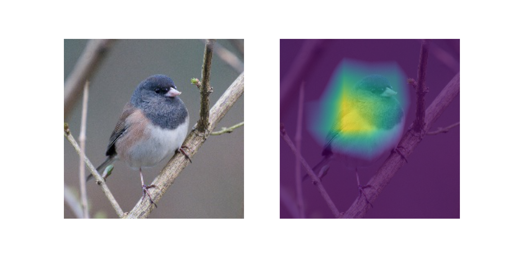

## XAI: Score-CAM

This project implements Score-CAM, a visual explanation method for convolutional neural networks.

Paper: [Score-CAM: Score-Weighted Visual Explanations for Convolutional Neural Networks](http://openaccess.thecvf.com/content_CVPRW_2020/papers/w1/Wang_Score-CAM_Score-Weighted_Visual_Explanations_for_Convolutional_Neural_Networks_CVPRW_2020_paper.pdf)

## Prerequisites
Development
- Python
- Pytorch
- Numpy
- Matplotlib
- other ML libraries

Score-CAM
- Trained neural network model with at least one 2D convolutional layer
- image data for prediction

## Run
Run an example on [Google Colab](https://colab.research.google.com/drive/1Ar32WDBcEG5UUF8qPfSTtFEvfFiw_E2J?usp=sharing)

Results can be found in ./results .

## Credits
This code is forked from the original [Score-CAM repo](https://github.com/haofanwang/Score-CAM).

